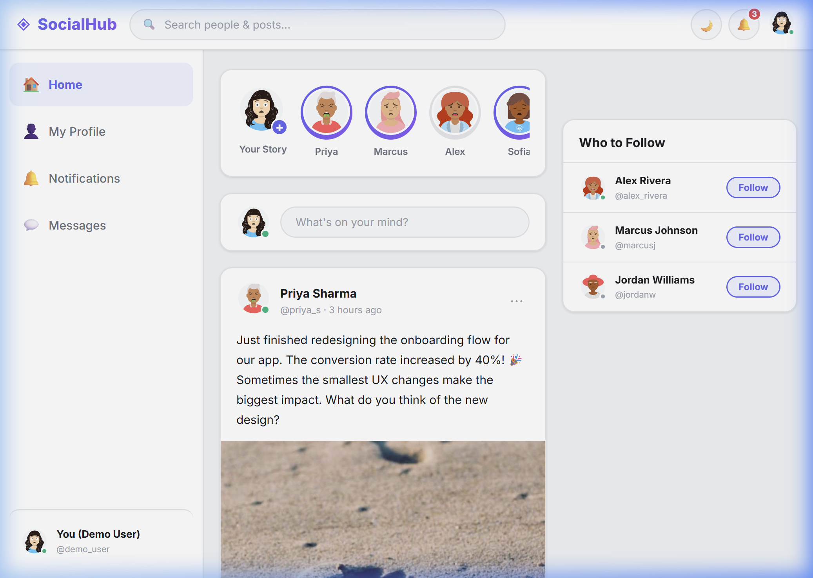
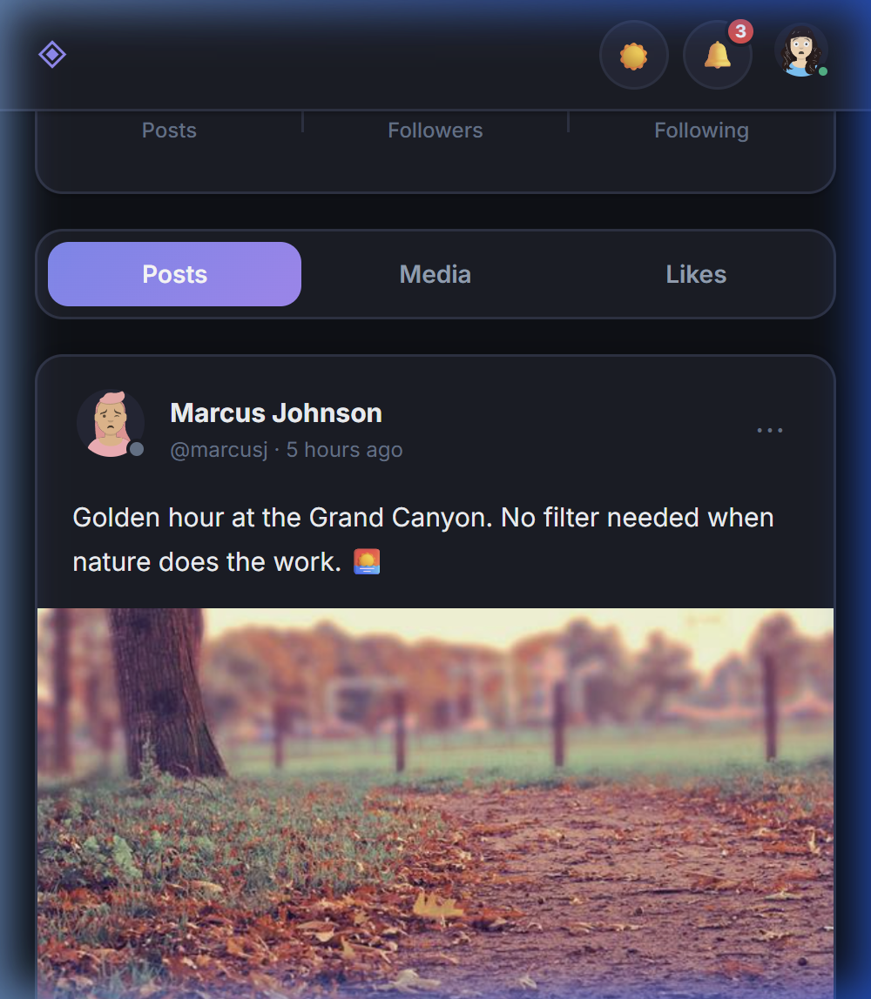
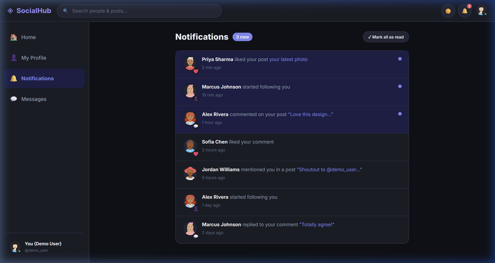
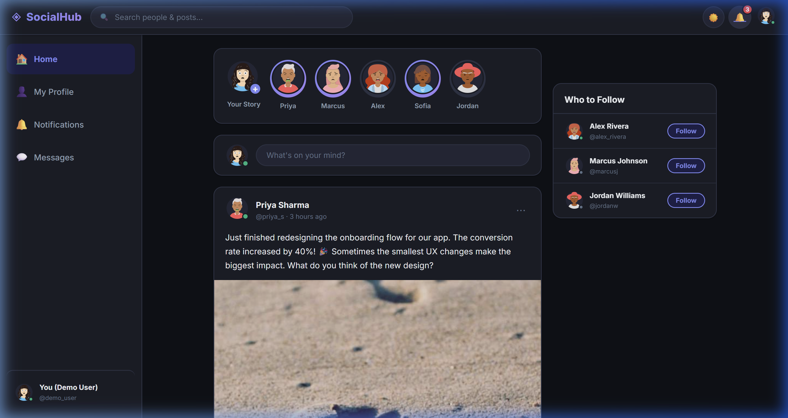
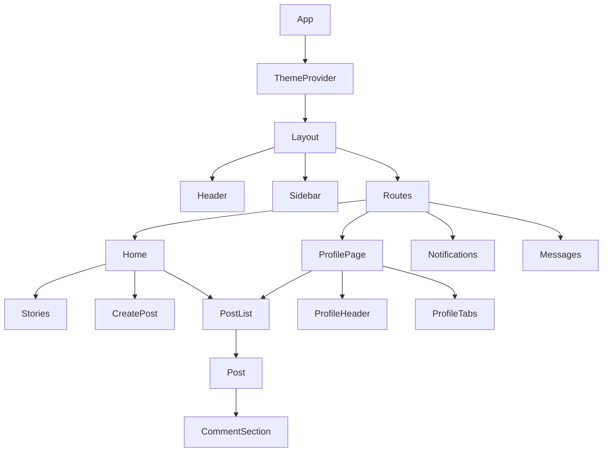

# Social Media Dashboard Project

## Project Overview

I built a social media dashboard with React that includes:
- User profile section
- Post feed with like/comment functionality
- Notifications panel
- Message system
- Responsive design for all devices

## What I Learned

1. **React Components**: How to break UI into reusable pieces
2. **State Management**: Using `useState` and `useEffect` hooks
3. **React Router**: Creating multi-page navigation in a single-page app
4. **API Integration**: Fetching and displaying data from APIs
5. **Testing**: Writing basic tests for React components

## Key Features

- 🔄 Real-time updates for likes and comments
- 📱 Fully responsive design
- 🌓 Dark/Light mode toggle
- 🔍 Search functionality
- 💬 Interactive comment system

## How to Run This Project

1. Clone the repository
2. Run `npm install` to install dependencies
3. Run `npm start` to start development server
4. Open http://localhost:3000 in your browser

## Screenshots

### 1. Desktop View of Dashboard

### 2. Mobile View

### 3. Different Pages (Notifications)

### 4. Dark Mode Version

---

## Technical Details

### Code Structure
The project is built using React with the following structure:
- **`src/components/`**: Contains reusable UI elements (`Post`, `Profile`, `Stories`, `Header`, `Sidebar`, etc.)
- **`src/pages/`**: Contains the main route views (`Home`, `ProfilePage`, `Notifications`, `Messages`)
- **`src/context/`**: Contains React Context providers (`ThemeContext` for dark mode)
- **`src/utils/`**: Contains utility functions and a mock async API (`mockData.js`, `api.js`) to simulate data fetching and network latency.
- **`src/styles/`**: Global CSS custom properties and resets (`globals.css`)

### Component Hierarchy Diagram

### Technical Requirements Met
- **React Components**: Used functional components and CSS Modules to encapsulate structure, logic, and styling into distinct, reusable blocks (e.g., `<Button />`, `<Avatar />`, `<Card />`).
- **State Management**: Utilized `useState` for local component state (like toggling 'likes', input fields, and UI interactions) and `useEffect` for data fetching lifecycle events.
- **React Router**: Implemented a multi-page feel utilizing `<HashRouter>` to seamlessly display different Dashboard views without reloading the browser.
- **API Integration**: Simulated fetching from an external backend using an asynchronous mock `api.js` layer with artificial delay, properly handling `loading` and `error` states in the UI.
- **Testing**: Configured Jest + React Testing Library unit tests to verify proper rendering and user interaction (e.g., clicking the Like button increments the count).
